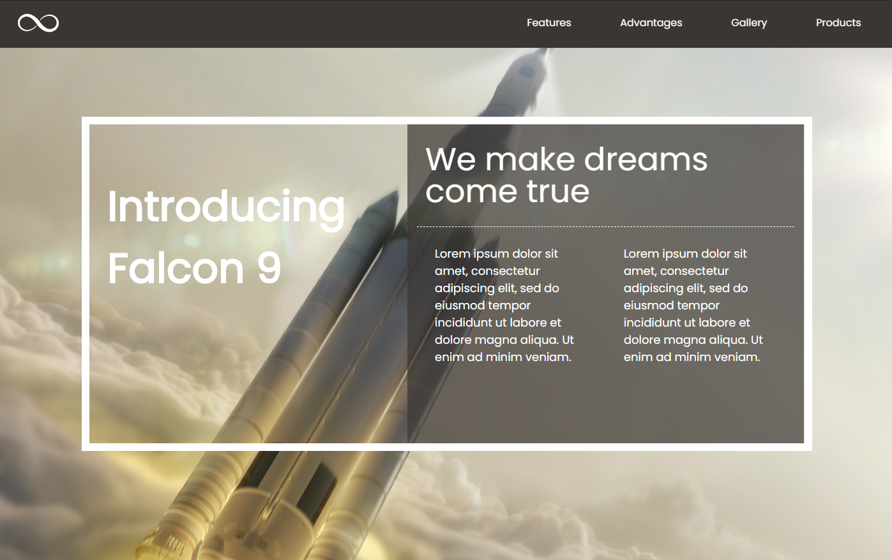

# Module 1 - Project - Build a webpage

## Demo

https://matcote.github.io/project-m1-htmlcss/

## Description

My first time making a website! This site was made using just HTML and CSS over the course of a weekend. I was given a mock-up and told to replicate it as pixel-perfect as possible.

The site is completely responsive! Try scaling it down to mobile and see for yourself!

## Preview

